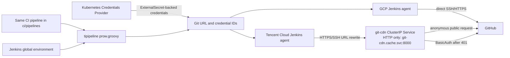
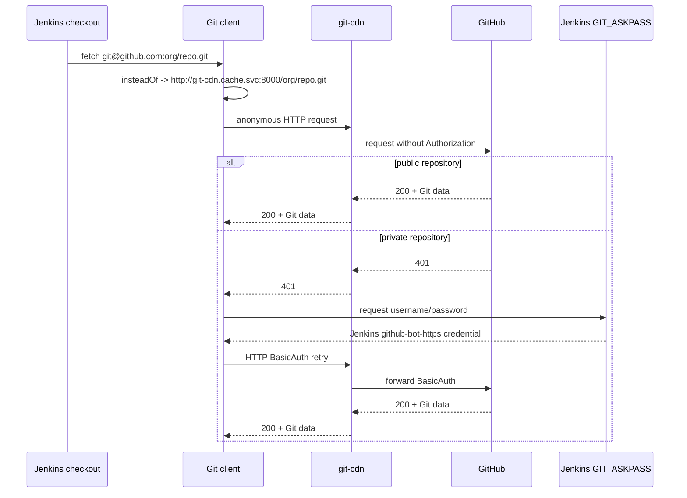

# Jenkins Git CDN Authentication

This document describes how the Jenkins shared library and the cluster
configuration cooperate when GitHub URLs are routed through git-cdn.

## Architecture



The `github-bot-https` credential is generated by the Kubernetes Credentials
Provider from the existing `github-bot-username` and `github-bot-token`
secrets. JCasC only supplies the global credential IDs and feature flags; it
does not contain a second copy of the GitHub credential.

## Authentication flow



Git does not query repository visibility before the request. It first tries
without credentials and invokes `GIT_ASKPASS` only when the HTTP server asks
for credentials. This keeps the PAT out of public repository requests.

## URL behavior

Tencent staging configures the following Git rewrite rules:

```text
https://github.com/       -> http://git-cdn.cache.svc:8000/
git@github.com:            -> http://git-cdn.cache.svc:8000/
ssh://git@github.com/      -> http://git-cdn.cache.svc:8000/
```

GCP and Tencent prod do not configure these rules. Their existing direct Git
transport behavior is unchanged, while the same credential IDs are available
for the shared CI library.

The original `refs/pull/<number>/head` and `refs/pull/<number>/merge` refspecs
are unchanged. URL rewriting affects the transport only.

## Credential responsibilities

| Credential | Jenkins ID | Use |
| --- | --- | --- |
| SSH private key | `github-sre-bot-ssh` | Direct GitHub SSH access when CDN routing is disabled |
| GitHub username and PAT | `github-bot-https` | HTTP authentication to git-cdn after a 401 |
| GitHub API PAT | `github-bot-token` | Existing API operations and the source for the HTTP credential |

The first two Git transport credentials are created by the Kubernetes
Credentials Provider from ExternalSecrets in `pre/credential-github.yaml`.
The shared library reads `GIT_SSH_CREDENTIALS_ID` and
`GIT_HTTP_CREDENTIALS_ID` from the Jenkins environment. These values are
credential IDs, not secret values.

## Cache and security requirements

The CDN must return 401 for an unauthenticated private repository request.
Returning 404 prevents Git from invoking `GIT_ASKPASS`.

An authenticated private request must not make private Git data available to
later unauthenticated requests from the cache. This must be tested explicitly
before enabling the rewrite for private repositories.

The CDN endpoint is intentionally an in-cluster HTTP Service. It is not
exposed by an Ingress or HTTPRoute. NetworkPolicy should restrict access to
Jenkins agents if the cluster policy model permits it.

## Rollout and rollback

The `ci` change is feature-gated by `GIT_CDN_ENABLED`. Without that variable,
the existing checkout behavior remains unchanged.

The rollout order is:

1. Merge the `ci` shared library PR.
2. Merge this `ee-ops` PR and allow Flux to reconcile the Jenkins instances.
3. Validate a TiFlash job with recursive submodules in GCP and Tencent Cloud.

Rollback is performed by setting `GIT_CDN_ENABLED=false` and removing the
three Tencent staging rewrite entries. Jenkins then returns to direct
SSH/HTTPS behavior without changing the CI pipeline files.
